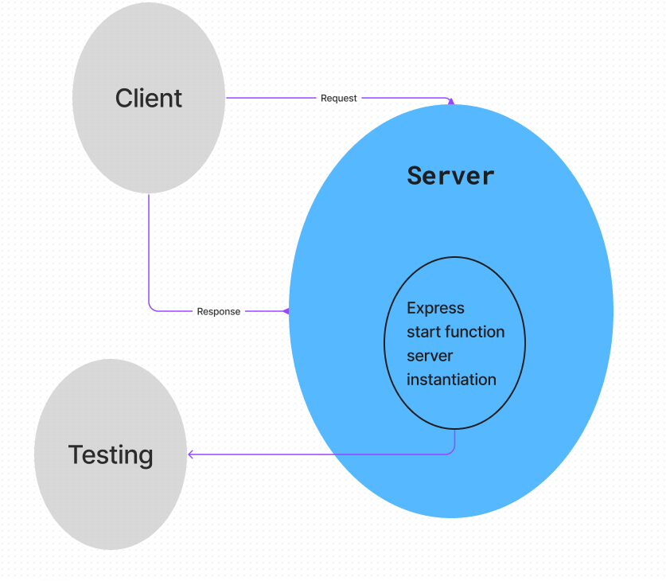

# basic-express-server

## 401d53 Lab 2 basic express server

## Project: Basic express server

### Author: Justin Mathieu

Problem Domain
 practice with basic server and testing.

## Links and Resources

- GitHub Actions ci/cd
- back-end dev server url
- back-end prod server url

## Collaborators

401d53 and 401d10
Used demo code as permitted.

## Setup

- port variable

## How to initialize/run your application (where applicable)

- Clone repo
- Run npm i in terminal
- Run nodemon in terminal

## Routes

- GET : /person/name - specific route to hit

## Tests

- Run the command npm test with dependencies installed.

## UML

